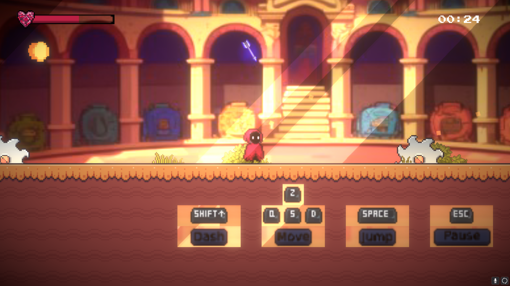

# Warrior's Escape



**Warrior's Escape** is a thrilling 2D game where your reflexes are your greatest weapon. As a brave warrior, your mission is to dodge a relentless barrage of arrows and magic spells to survive and achieve freedom. The game features progressively increasing difficulty, fluid movements, and stunning visuals that make for an intense and action-packed adventure.

---

## **Features**

-   **Dynamic Gameplay**:

    -   Dodge arrows and magical projectiles in real-time action.
    -   Difficulty increases the longer you survive, testing your reflexes to the limit.

-   **Advanced Player Controls**:

    -   Fluid character movements with responsive dashes for quick escapes.
    -   Intuitive controls designed for an engaging player experience.

-   **Visual and Audio Excellence**:

    -   High-quality 2D animations with smooth transitions and slick effects.
    -   Enhanced graphics using Unity shaders for immersive environments.
    -   Thrilling sound effects and background music to heighten the intensity.

---

## **Technology Stack**

-   **Engine**: Unity
-   **Programming Language**: C#
-   **Art Assets**: Free and custom-designed 2D assets and animations
-   **Graphics Enhancements**: Unity shaders for lighting and effects
-   **Audio**: Free sound effects and dynamic background music

---

## **How to Play**

1. **Movement**: Use arrow keys or WASD to move the warrior and space to make him jump.
2. **Dashing**: Use the shift key to perform a dash and avoid incoming attacks.
3. **Objective**: Survive as long as possible while dodging an increasing number of projectiles.

> **Tip**: Time your dashes wisely to escape tight situations and aim for a high score!

---

## **Installation**

1. **Check Releases & Download the Game**:
2. **Run the Game**:
    - Extract the downloaded folder and open the executable file (`WarriorsEscape.exe` for Windows or equivalent for other platforms).

---

## **Contributing**

Contributions are welcome! If you have ideas for improvements, new features, or bug fixes, feel free to contribute.

1. Fork the repository.
2. Create a feature branch:
    ```bash
    git checkout -b feature-name
    ```
3. Commit your changes:
    ```bash
    git commit -m "Description of changes"
    ```
4. Push to the branch:
    ```bash
    git push origin feature-name
    ```
5. Open a pull request.

---

## **License**

This project is licensed under the [MIT License](LICENSE).

---

**Made with ❤ by the Krichen Yassine**
